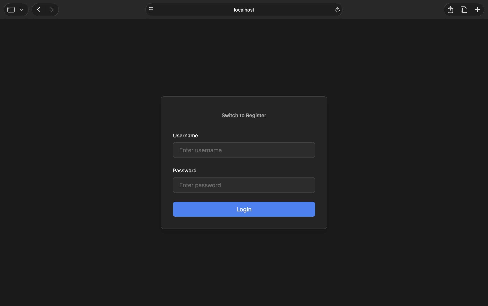

# Auth App: OAuth2 + Cookies + FastAPI + React

## Overview

This is a full-stack app with cookie-based auth built around an OAuth2 password flow: the FastAPI backend creates JWT access tokens at login, stores them in an HTTP-only cookie, and provides register, verify, protected data, and logout endpoints built with SQLAlchemy. Passwords are hashed with bcrypt. The React + Vite frontend covers registration and login, a page that loads protected items, and logout.

## Screenshots

## Backend Setup

1. Go to the `back` folder, place your real data in file `env.example`, and rename it to `.env`.

2. Run `python -m venv venv` (or `python3 -m venv venv`).

3. Run `source venv/bin/activate`.

4. Run `pip install -r requirements.txt`.

5. Run `uvicorn main:app --reload --port 8001`.

## Frontend Setup

1. Go to the `front` folder.

2. Run `npm i`.

3. Run `npm run dev`.

## How to Use

Just open the URL printed by `npm run dev`.

## Technologies

### Backend

- `fastapi` — main web framework for building APIs
- `uvicorn` — ASGI server that runs FastAPI application
- `SQLAlchemy` — ORM
- `python-jose`, `cryptography` — JWT creation and verification
- `passlib`, `bcrypt` — password hashing
- `python-dotenv` — load secrets from `.env`

### Frontend

- `React` — frontend framework
- `vite` — frontend build tool
- `tailwindcss 4+` — modern CSS framework
